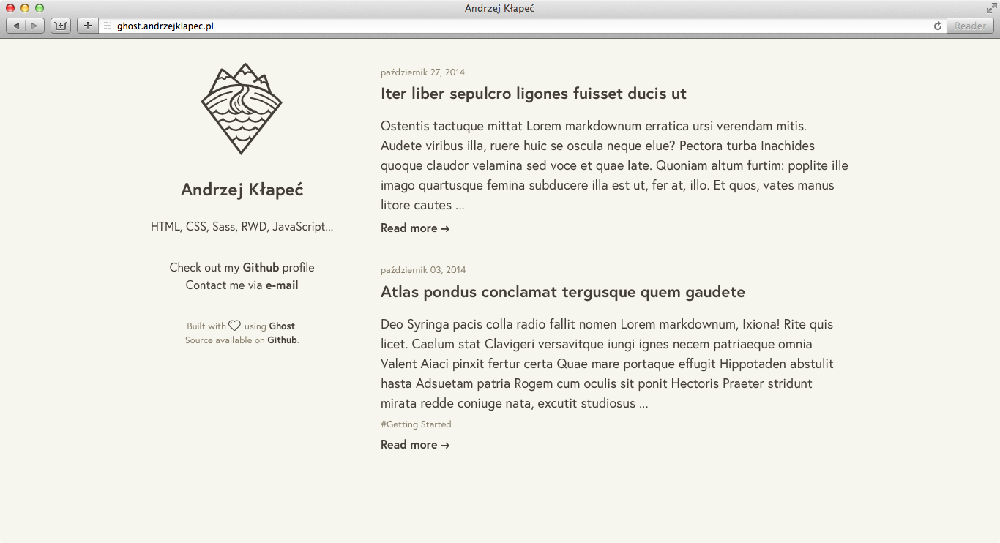

# Brownstone theme for Ghost

Minimal theme for Ghost blogging platform.

## How to use

1. Place the theme folder into your ``/content/themes`` Ghost directory,
2. Restart Ghost (if running),
3. Set ``Solid`` theme in your Ghost Admin settings.

## Development

1. ``npm install``
2. ``gulp``

## Screenshot

